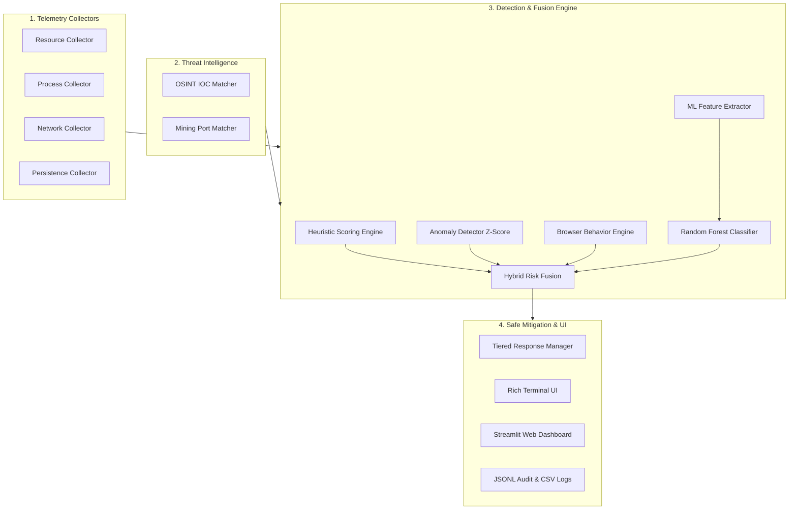

# CryptoJackGuard 🛡️

[](https://www.python.org/downloads/)
[](LICENSE)
[]()

> **CryptoJackGuard** is a lightweight, defensive, machine learning-powered endpoint monitoring system designed to detect and mitigate unauthorized cryptocurrency mining (cryptojacking) on personal computers.

---

## 🛡️ Project Overview

Cryptojacking is the unauthorized hijacking of computing resources (CPU, GPU, memory, and network sockets) to mine cryptocurrency on victim devices without consent. Traditional antivirus solutions often miss stealthy, in-browser, or obfuscated miners that mimic benign tasks or throttle execution.

**CryptoJackGuard** combines multi-layered heuristic analysis, OSINT threat intelligence, statistical anomaly detection, auto-start persistence auditing, and a Random Forest Machine Learning classifier to deliver robust, privacy-preserving cryptojacking defense.

---

## ✨ Key Features

- **Multi-Layered Detection Engine:**
  - **Resource Telemetry:** Real-time tracking of CPU, memory, and GPU usage.
  - **OSINT Threat Intelligence:** Fast local indicator matching against known mining pools, wallet protocols, and suspicious ports (`3333`, `4444`, `7777`, Stratum).
  - **Behavioral Anomaly Detection:** Rolling Z-score anomaly tracking to catch sudden deviations from baseline process behavior.
  - **Persistence & Masquerading Auditing:** Identifies binaries executing from suspicious paths (`Temp`, `AppData`) or disguised as legitimate system services (`svchost.exe`).
- **🧠 Machine Learning Engine (Random Forest):**
  - Extracts 5 key runtime features and provides probabilistic risk confidence (`ml_confidence`).
  - **Hybrid Risk Fusion:** Fuses heuristic scores with ML confidence to prevent false negatives while suppressing false alarms.
- **🛡️ Safe Tiered Response System:**
  - **Tier 1 (Low Risk < 40):** Passive continuous monitoring.
  - **Tier 2 (Medium Risk 40–59):** Forensic audit logging with elevated scrutiny.
  - **Tier 3 (High Risk ≥ 60):** User-guided interactive termination prompt with protected process safeguards and a 120-second suppression cooldown.
- **📊 Dual Visualization Interfaces:**
  - **Terminal Dashboard:** Interactive, live terminal UI powered by `rich`.
  - **Enterprise Web Dashboard:** Modern, reactive Streamlit web interface with real-time process details, telemetry metrics, and kill switch controls.

---

## 🏗️ Architecture

CryptoJackGuard operates as a modular, feed-forward pipeline:



---

## 🚀 Quick Start

### 1. Prerequisites & Installation
Ensure you have Python 3.12+ installed.

```powershell
# Clone the repository
git clone https://github.com/PubuduTerance/CryptoJackGuard.git
cd CryptoJackGuard

# Set up virtual environment
python -m venv .venv
.\.venv\Scripts\Activate.ps1

# Install required dependencies
pip install -r requirements.txt
```

### 2. Running CryptoJackGuard

- **Option A: Terminal CLI Dashboard**
  ```powershell
  python main.py
  ```

- **Option B: Enterprise Web Dashboard (Streamlit)**
  ```powershell
  streamlit run dashboard_app.py
  ```

For detailed usage and options, refer to the [User Guide](USER_GUIDE.md) and [Installation Guide](INSTALL.md).

---

## 📊 Evaluation & Performance

CryptoJackGuard was rigorously validated through automated evaluation suites:

1. **Controlled Thesis Scenarios ([tests/run_thesis_evaluation.py](tests/run_thesis_evaluation.py)):**
   - **10 / 10 Scenarios Passed (100.0% Accuracy)** across baseline Windows tasks, high-CPU video rendering, simulated miners (`xmrig`), masquerading binaries, browser cryptojacking, and enterprise Java servers.
   - Zero false positives on legitimate high-compute workloads.
   - Full evaluation report available at [docs/thesis_evaluation_report.md](docs/thesis_evaluation_report.md).

2. **Performance Benchmark ([tests/run_performance_benchmark.py](tests/run_performance_benchmark.py)):**
   - **Total Scan Loop Latency:** `~3.4 seconds` total cycle time.
   - **Process Discovery Overhead:** Optimized down from `~15.9s` to **`~150 ms`** steady-state (~99% reduction).
   - **Host CPU Overhead:** Minimal background agent footprint (< 1-2% CPU).
   - Full benchmark report available at [docs/performance_benchmark_report.md](docs/performance_benchmark_report.md).

---

## ⚠️ Disclaimer & Ethical Statement

> **Defensive Research Prototype Only:**  
> CryptoJackGuard was developed solely for final-year cybersecurity research and educational defense evaluation.
> - This repository **does not contain any malware, exploits, mining payloads, or malicious persistence code**.
> - It **does not inspect private network payloads, browser histories, or user data**.
> - All tests utilize safe, benign CPU-bound mathematical operations and mock telemetry.

For more details on responsible disclosure and security principles, see [SECURITY.md](SECURITY.md).
